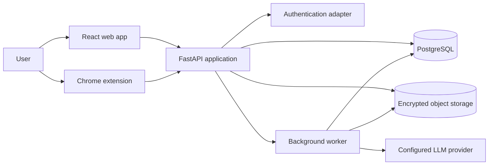
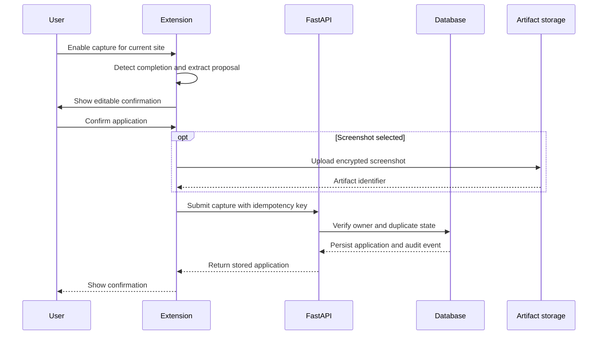
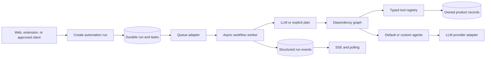

# System architecture

## Current implementation direction

Career Workspace uses a modular Python backend, a React web application, and a React Chrome extension. The first release remains one deployable backend so authorization, deletion, and audit behavior stay easy to reason about.



## Application capture flow



## Backend modules

- `auth`: current-user resolution and the future managed identity adapter
- `applications`: capture, timeline, updates, and duplicate handling
- `artifacts`: encrypted file storage and metadata
- `privacy`: export, consent, retention, and deletion receipts
- `assistant`: existing skills, tools, specialists, and streaming
- `database`: sessions, models, and migrations
- `observability`: metadata-only logs and audit events

## Extraction-ready module boundaries

The product remains one Python process and one database while usage is small. Modules communicate through versioned HTTP contracts, typed schemas, durable records, and explicit service interfaces. They do not depend on frontend state or hidden global objects.

```text
backend/
  integrations/
    llm/                 provider-neutral language model contract
  modules/
    automation/          runs, task graphs, tools, agents, conversations
    applications/        application lifecycle and timeline contracts
  app.py                 composition root
```

The first likely extractions are the automation worker, artifact processing, and communication ingestion. An extracted service must preserve the same API schemas and ownership checks before its queue or deployment changes.

## Automation flow



Independent ready tasks run concurrently. Dependent tasks wait for their declared prerequisites. The local queue uses `asyncio.Queue`. A Redis, SQS, or managed queue adapter can replace it without changing the run API.

## Storage

PostgreSQL is the production database. Local development may use SQLite when Docker is not running. The application uses SQLAlchemy so the same ownership and service logic is exercised in both environments.

Object bytes are encrypted before being written by the storage adapter. The database stores ownership, content type, size, digest, storage key, and retention metadata.

## Authentication boundary

Local development uses a signed, short-lived local session cookie. The local session adapter is not accepted when the environment is configured for production. A managed passwordless identity provider will replace the adapter before a public deployment.

The unpacked development extension may request a short-lived local bearer token from the same development-only adapter. A public extension must use a user-approved pairing flow backed by managed authentication.

Every user-owned query includes the authenticated user identifier. Client-supplied owner identifiers are never trusted.

## LLM boundary

Capture extraction is deterministic first. The initial extension does not need an LLM to identify a page title, company, role, or confirmation message. A provider abstraction will allow an inexpensive model to normalize difficult captures later.

Resume and chat content is sent only after a user action. The product must show the configured provider and explain what content leaves the service boundary.

OpenAI calls are server-side through one provider interface. Clients never receive the API key. Normal requests disable provider-side storage, use a privacy-preserving safety identifier, apply output limits, and attach structured component metadata. Career Workspace owns job state and conversation history instead of depending on provider retention.

The authenticated automation API is the universal product entry point for model-backed work. Web, extension, and future approved clients create the same run contract. They can supply an explicit task graph or let the bounded planner select registered tools and agents. The current local worker runs from the FastAPI lifecycle; a production queue adapter can move execution to separate worker processes without changing client contracts.

## Deployment shape

Local development uses Docker Compose for the API and PostgreSQL, while Vite supports fast frontend and extension development. The architecture remains portable until a cloud provider is selected.
